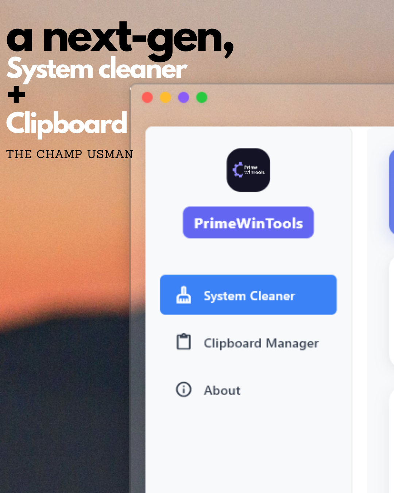
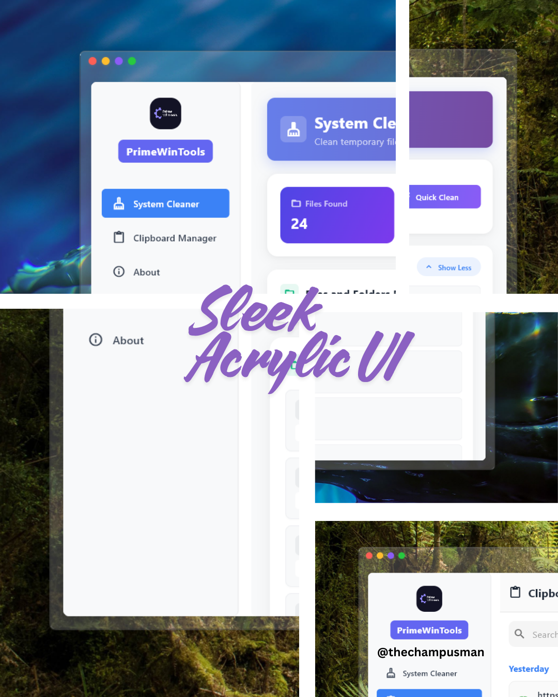
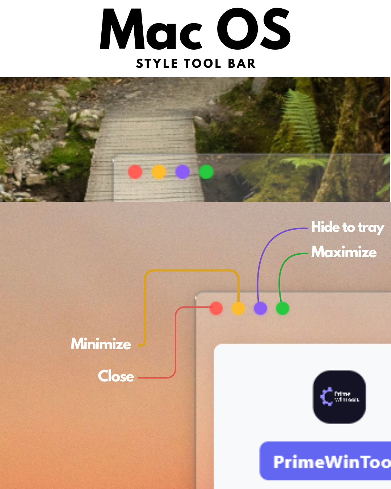
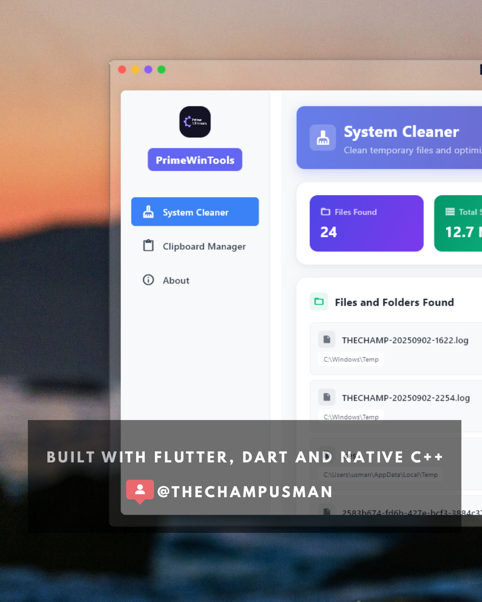

# PrimeWinTools

PrimeWinTools is a versatile utility for Windows users, combining powerful clipboard management with system cleanup features. Whether you're a power user who frequently handles large amounts of copied content or someone looking to optimize your system performance by cleaning unnecessary files, PrimeWinTools makes it simple and efficient.

---

## 📸 Screenshots

### Main Application Views

  
  

  
  

### Additional Screenshots

  
  

  
  

  

---

## 🔥 Key Features

### 1. Clipboard Manager:
- Stores and manages clipboard history for up to 20 days.
- Easily retrieve, search, and delete previous clipboard entries.
- Avoid losing important copied data with clipboard tracking.
- Designed for professionals and power users who frequently copy text, files, and images.

### 2. System Cleaner:
- Cleans system directories like **Prefetch**, **Temp**, and **%TEMP%** to free up disk space.
- Helps to improve overall system performance by removing unnecessary temporary files.
- **Log history** feature to track past cleanup operations for transparency.

### 3. Localhost Manager:
- Real-time monitoring of active localhost ports and services.
- Automatic detection of running processes and their associated ports.
- Service identification for common development frameworks (React, Node.js, Angular, etc.).
- Quick access to open services in browser or copy URLs to clipboard.
- Advanced port scanning with process identification and PID tracking.

### 4. User-Friendly Interface:
- Clean and simple UI like Acrylic material blur for ease of use and look appealing.
- Efficient background operation without interrupting your workflow.
- Built with Flutter, ensuring a smooth native Windows experience.

---

## 🚀 Getting Started

### Installation:

1. Download the latest release from the [Releases]([https://github.com/thechampusman/PrimeWinTools/releases]) section.
2. Run the installer and follow the on-screen instructions.

### Requirements:
- **Operating System**: Windows 10 or later
- **Flutter SDK**: Required for contributors who want to build or modify the project.

---

## 🛠️ How to Use

### Clipboard Manager:
1. Launch PrimeWinTools.
2. The clipboard manager will automatically track and store your clipboard history for the past 20 days.
3. Use the UI to view, search, or delete specific clipboard entries.

### System Cleaner:
1. Go to the **System Cleaner** tab.
2. Click "Clean" to remove unnecessary files from key system directories.
3. Check the log history to track past cleanups.

### Localhost Manager:
1. Navigate to the **Localhost** tab.
2. Click "Refresh" to scan for active localhost ports and services.
3. View detailed information about each port including process name, PID, and service type.
4. Use the action buttons to open services in browser or copy URLs to clipboard.
5. Monitor development servers and identify what's running on each port.

---

## 📜 License

PrimeWinTools is licensed under a **custom proprietary license**. You are allowed to contribute to the project by submitting pull requests or patches, but the following restrictions apply:
- You may **not copy**, redistribute, or create new distributions, forks, or versions of this software without explicit written permission from the copyright holder.
- You may **not sublicense, sell, or transfer** this software in any way without permission.

For more details, please see the [LICENSE](./LICENSE.txt) file.

---

## 💻 Contributing

We welcome contributions from the community! Here’s how you can help:

1. Fork the repository.
2. Create a new branch (`git checkout -b feature/AmazingFeature`).
3. Commit your changes (`git commit -m 'Add some AmazingFeature'`).
4. Push to the branch (`git push origin feature/AmazingFeature`).
5. Open a pull request.

Please ensure your changes follow the contribution guidelines and licensing terms.

---

## 🌟 Features Roadmap

- Add support for more system cleanup options.
- Introduce a customizable clipboard retention period.
- UI enhancements and additional customization features.

---

## 🤝 Support

If you encounter any issues or have any questions, feel free to open an issue on GitHub or contact us via [Your Email].

---

## 📊 Logs & Privacy

PrimeWinTools does not collect or transmit any personal data. All logs related to system cleanups are stored locally for user reference and transparency.

---

## 📜 Acknowledgments

- Built with Flutter for a native experience on Windows.
- Thank you to all contributors who have helped improve this project.

---

Enjoy using **PrimeWinTools** to optimize your clipboard and system performance!

